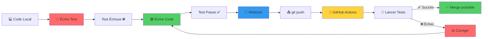
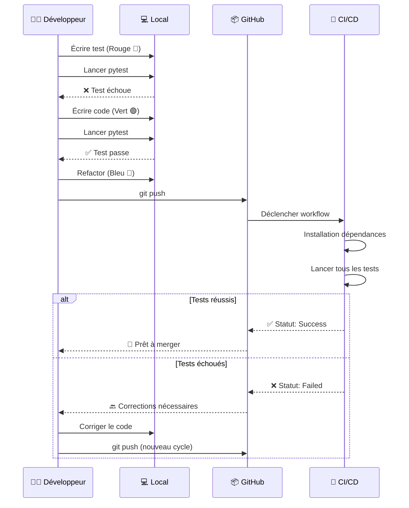

# Workshops Tests Python & CI/CD

Série de workshops pratiques pour apprendre les tests unitaires, le développement piloté par les tests (TDD) et l'intégration continue (CI/CD) avec Python.

## 🎯 Objectifs pédagogiques

L'objectif principal de ces workshops est d'apprendre les **méthodes CI/CD** et les bonnes pratiques de développement moderne.

À la fin de cette série, vous maîtriserez :
- 🧪 **Tests unitaires** avec pytest
- 🔄 **TDD (Test-Driven Development)** - Développement piloté par les tests
- 🤖 **GitHub Actions** - Configuration de workflows CI/CD automatisés
- 📦 **uv** - Gestion moderne des dépendances Python
- 🚀 **FastAPI** - Construction d'APIs REST testables
- 🎭 **Mocking** - Simulation de dépendances externes

## 📚 Série de workshops

### Workshop 1 : Fondamentaux TDD & CI/CD (3 heures)
**Projet** : API Météo

Apprenez les bases du TDD en construisant une API météo.

**Compétences acquises** :
- Cycle TDD (Rouge → Vert → Refactoriser)
- Écriture de tests unitaires avec pytest
- Mocking d'appels API externes
- Gestion d'erreurs et cas limites
- Configuration de GitHub Actions pour CI/CD

**Branche** : `workshop-1`

---

### Workshop 2 : Tests de base de données & intégration (3 heures)
**Projet** : Raccourcisseur d'URL

Construisez un service de raccourcissement d'URL avec persistance en base de données.

**Compétences acquises** :
- Tests de base de données (SQLite/Postgres)
- Tests d'intégration vs tests unitaires
- Fixtures et setup/teardown
- Tests d'opérations CRUD
- Fonctionnalités avancées de pytest

**Branche** : `workshop-2`

---

### Workshop 3 : Patterns de tests avancés (3 heures)
**Projet** : À déterminer

Techniques de tests avancées pour applications en production.

**Compétences acquises** :
- Property-based testing
- Tests de performance
- Analyse de couverture de code
- Tests de code asynchrone
- Bonnes pratiques et patterns

**Branche** : `workshop-3`

---

## 🚀 Démarrage

### Prérequis

- **Python 3.11+**
- **Git**
- **uv** (gestionnaire de paquets Python moderne)
- **Compte GitHub**
- **Éditeur de texte** (VS Code recommandé)

### Installation

**📖 Guide complet** : Consultez le [Guide d'installation](docs/setup-guide.md) pour des instructions détaillées.

**Installation rapide** :

1. **Installer uv**
   ```bash
   # macOS/Linux
   curl -LsSf https://astral.sh/uv/install.sh | sh

   # Windows
   powershell -c "irm https://astral.sh/uv/install.ps1 | iex"

   # Vérifier l'installation
   uv --version
   ```

2. **Cloner ce dépôt**
   ```bash
   git clone https://github.com/umons-ig/edl-tp-1.git
   cd edl-tp-1
   ```

3. **(Optionnel) Explorer les exemples**
   ```bash
   git checkout examples
   # Parcourir les exemples complets (démo calculatrice, exemples de mocking)
   ```

4. **Démarrer le Workshop 1**
   ```bash
   git checkout workshop-1
   uv sync
   uv run pytest
   # Suivre le README.md dans cette branche
   ```

## 📖 Structure des branches

- **`main`** - Cette page d'aperçu et documentation
- **`examples`** - Implémentations de référence complètes (démo calculatrice)
- **`workshop-1`** - Exercices API Météo (code de départ incomplet)
- **`workshop-2`** - Exercices Raccourcisseur d'URL (code de départ incomplet)
- **`workshop-3`** - Exercices de tests avancés (code de départ incomplet)

## 💡 Comment utiliser ce dépôt

Chaque workshop est sur sa propre branche avec :
- Code de départ incomplet (avec TODOs)
- Fichiers de tests qui guident votre implémentation
- README avec instructions détaillées
- Workflow GitHub Actions pour CI/CD

**Flux de travail** :
1. Checkout la branche du workshop
2. Lire le README
3. Lancer les tests pour voir ce qui échoue
4. Implémenter le code pour faire passer les tests
5. Push et voir la CI/CD en action

## 📝 Parcours d'apprentissage

```
branche examples (optionnel)
    ↓
workshop-1: Bases TDD + mocking
    ↓
workshop-2: Base de données + tests d'intégration
    ↓
workshop-3: Patterns avancés
```

## 🛠️ Outils & technologies

- **uv** - Gestionnaire de paquets Python rapide
- **pytest** - Framework de tests
- **FastAPI** - Framework web moderne
- **GitHub Actions** - Plateforme CI/CD
- **Open-Meteo API** - API météo gratuite (pas de clé requise)
- **SQLite/Postgres** - Base de données (workshop 2+)

## 📚 Ressources supplémentaires

Consultez le dossier [`docs/`](docs/) pour :
- [Guide d'installation](docs/setup-guide.md) - Instructions détaillées d'installation
- [Aide-mémoire pytest](docs/pytest-cheatsheet.md) - Référence rapide
- [Dépannage](docs/troubleshooting.md) - Problèmes courants et solutions
- [Guide GitHub Actions](GITHUB_ACTIONS_GUIDE.md) - Configuration CI/CD pas-à-pas

## 🎓 Méthodologie CI/CD enseignée

Ce workshop met l'accent sur les **pratiques DevOps modernes** :

### 📊 Workflow TDD + CI/CD



### Développement piloté par les tests (TDD)
1. **🔴 Rouge** : Écrire un test qui échoue
2. **🟢 Vert** : Écrire le code minimal pour le faire passer
3. **🔵 Refactor** : Améliorer le code tout en gardant les tests verts

### Intégration Continue (CI)
- Tests automatiques à chaque push
- Vérification de la qualité du code
- Détection précoce des bugs
- Workflow GitHub Actions configuré

### Livraison Continue (CD)
- Déploiement automatisé (workshops avancés)
- Environnements de test
- Pipeline de release

### 🔄 Workflow Complet avec Git



## 🤝 Contribution

Vous avez trouvé un problème ou avez une suggestion ? N'hésitez pas à ouvrir une issue ou soumettre une pull request !

## 📄 Licence

Ce matériel de workshop est destiné à des fins éducatives.

## 👨‍🏫 Instructeurs

Créé pour les cours de génie logiciel de l'UMONS.

---

**Prêt à commencer ?**
```bash
git checkout workshop-1
```

**Besoin d'aide pour l'installation ?**
```bash
# Consulter le guide détaillé
cat docs/setup-guide.md
```