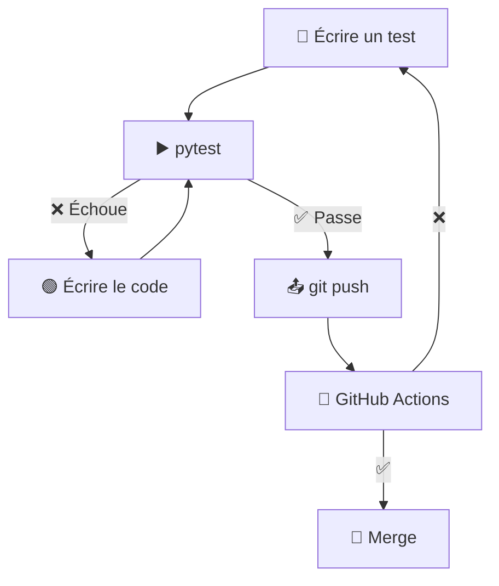

# Workshops Tests Python & CI/CD

Série de workshops pratiques pour apprendre les tests unitaires, le développement piloté par les tests (TDD) et l'intégration continue (CI/CD) avec Python.

## 🎯 Objectifs

L'objectif principal de ces workshops est d'apprendre les **méthodes CI/CD** et les bonnes pratiques de développement moderne.

À la fin de cette série, vous maîtriserez :

- 🧪 **Tests unitaires** avec pytest
- 🔄 **TDD (Test-Driven Development)** - Développement piloté par les tests
- 🤖 **GitHub Actions** - Configuration de workflows CI/CD automatisés
- 📦 **uv** - Gestion moderne des dépendances Python
- 🚀 **FastAPI** - Construction d'APIs REST testables
- 🎭 **Mocking** - Simulation de dépendances externes

## 📚 Série de workshops

### Workshop 1 : Fondamentaux TDD & CI/CD (3 heures)

**Projet** : API Météo

Apprenez les bases du TDD en construisant une API météo.

**Compétences acquises** :

- Cycle TDD (Rouge → Vert → Refactoriser)
- Écriture de tests unitaires avec pytest
- Mocking d'appels API externes
- Gestion d'erreurs et cas limites
- Configuration de GitHub Actions pour CI/CD

**Branche** : `workshop-1`

---

### Workshop 2 : Tests de base de données & intégration

**Projet** : Raccourcisseur d'URL

Construisez un service de raccourcissement d'URL avec persistance en base de données.

**Compétences acquises** :

- Tests de base de données (SQLite/Postgres)
- Tests d'intégration vs tests unitaires
- Fixtures et setup/teardown
- Tests d'opérations CRUD
- Fonctionnalités avancées de pytest

**Branche** : `workshop-2`

---

## 🚀 Démarrage

### Prérequis

- **Python 3.11+**
- **Git**
- **uv** (gestionnaire de paquets Python moderne)
- **Compte GitHub**
- **Éditeur de texte** (VS Code recommandé)

### Installation

**📖 Guide complet** : Consultez le [Guide d'installation](docs/setup-guide.md) pour des instructions détaillées.

**Installation rapide** :

1. **Installer uv**

   ```bash
   # macOS/Linux
   curl -LsSf https://astral.sh/uv/install.sh | sh

   # Windows
   powershell -c "irm https://astral.sh/uv/install.ps1 | iex"

   # Vérifier l'installation
   uv --version
   ```

2. **Cloner ce repository**

   ```bash
   git clone https://github.com/umons-ig/edl-tp-1.git
   cd edl-tp-1
   ```

## 💡 Comment utiliser ce dépôt

Chaque workshop est sur sa propre branche avec :

- Code de départ incomplet (avec TODOs)
- Fichiers de tests qui guident votre implémentation
- README avec instructions détaillées
- Workflow GitHub Actions pour CI/CD

## 🛠️ Outils & technologies

- **uv** - Gestionnaire de paquets Python rapide
- **pytest** - Framework de tests
- **FastAPI** - Framework web moderne
- **GitHub Actions** - Plateforme CI/CD
- **Open-Meteo API** - API météo gratuite (pas de clé requise)
- **SQLite/Postgres** - Base de données (workshop 2+)

## 📚 Ressources supplémentaires

Consultez le dossier [`docs/`](docs/) pour :

- [Guide d'installation](docs/setup-guide.md) - Instructions détaillées d'installation
- [Aide-mémoire pytest](docs/pytest-cheatsheet.md) - Référence rapide
- [Dépannage](docs/troubleshooting.md) - Problèmes courants et solutions
- [Guide GitHub Actions](GITHUB_ACTIONS_GUIDE.md) - Configuration CI/CD pas-à-pas

## 🎓 Méthodologie CI/CD enseignée

Ce workshop met l'accent sur les **pratiques DevOps modernes** :

### 📊 Workflow TDD + CI/CD



## 🤝 Contribution

Vous avez trouvé un problème ou avez une suggestion ? N'hésitez pas à ouvrir une issue ou soumettre une pull request !

## 📄 Licence

Ce matériel de workshop est destiné à des fins éducatives.
